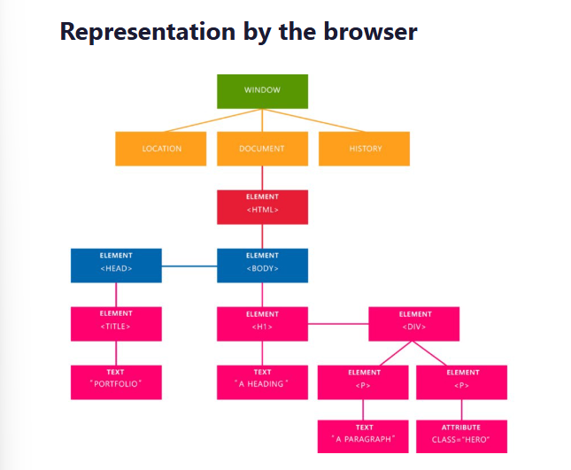

# Summary Of the Challenge 

## What I Learned


### What is DOM ? 
The DOM (Document Object Model) is an interface that represents how your HTML and XML documents are read by the browser. It allows a language (JavaScript) to manipulate, structure, and style your website. After the browser reads your HTML document, it creates a representational tree called the Document Object Model and defines how that tree can be accessed.


**Document**: It treats all the HTML documents.
**Elements**: All the tags that are inside your HTML or XML turn into a DOM element.
**Text**: All the tags’ content.
**Attributes**: All the attributes from a specific HTML element. In the image, the attribute class=”hero” is an attribute from the _<_p> element.

#### DOM methods 

The DOM has a lot of [methods](https://developer.mozilla.org/en-US/docs/Web/API/Document_Object_Model/Introduction). They are the connection between our nodes (elements) and events

#### [DOM Events](https://www.w3schools.com/jsref/dom_obj_event.asp)


#### Traversing the DOM

- .childNodes
This property returns a nodeList of child nodes of the given element. It returns text, comments, and so on. So, when you want to use it, you should be careful


- .nodeValue
This property is specific for texts and comments, as it returns or sets the value of the current node.


- .[nodeType](https://www.w3schools.com/jsref/prop_node_nodetype.asp)
This property returns the type of the given element.


##  Challenges I Faced 

achieve a specific range using `Math.random` in JavaScript:


The `Math.random()` function gives us a decimal number between 0 (inclusive) and 1 (exclusive), meaning it could be 0.23, 0.75, or 0.99, _but never exactly 1_. If we want a random whole number in a specific range—say, from 1 to 10—we need to scale and adjust it. Here’s how:

1. **Scale up**: Multiply `Math.random()` by the **range of numbers we want**. For example, if we want a number between 1 and 10, we can multiply it by 10. This gives us a new range from 0 (inclusive) up to 10 (exclusive), like 3.45 or 7.89.

2. **Shift to whole numbers**: Use `Math.floor()` to round down to the nearest whole number. This converts a number like 7.89 into 7, giving us whole numbers from 0 to 9.

3. **Adjust the range**: To get our final range of 1 to 10, we simply add 1. Now, we have whole numbers from 1 to 10, like this:

   ```javascript
   let randomNum = Math.floor(Math.random() * 10) + 1;

    // If wanna our range to be from 0 to 10 

    let random2 = Math.floor(Math.random() * 11)
   ```

Now, `randomNum` will always be a whole number between 1 and 10, making it easy to select items in an array or choose random colors!


## Resources
[DOM Manipulation](https://www.freecodecamp.org/news/whats-the-document-object-model-and-why-you-should-know-how-to-use-it-1a2d0bc5429d/#:~:text=Advantages,the%20page%20without%20a%20refresh.)

[JavaScript Math Functions Explained](https://www.freecodecamp.org/news/math-in-javascript/)
